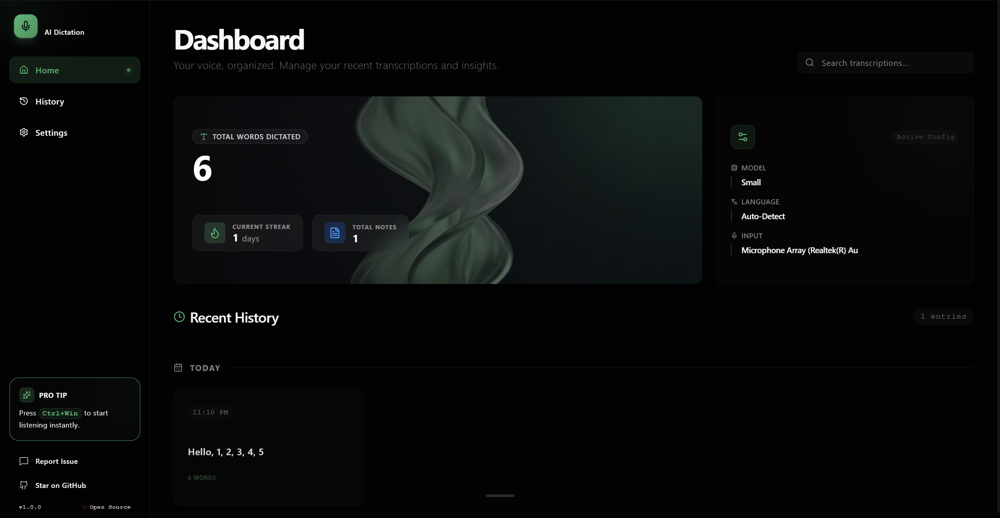

# VoiceFlow

<p align="center">
  
</p>

# Own your Voice.

**Dictate freely with local AI. Zero latency. Zero data leaks. Zero cost.**

VoiceFlow brings OpenAI's Whisper directly to your Windows machine. Every word you speak is processed entirely on your hardware—your voice data never leaves your device. Built for privacy-conscious professionals who demand speed and reliability.

---

### Unbreakable Privacy

Everything runs on localhost. Your microphone data never leaves your RAM. We can't sell your data because we never see it.

*   **Air-Gapped Safe**: Works completely offline after initial model download.
*   **Open Source**: Audit every line of code yourself.
*   **No Telemetry**: Zero tracking, zero analytics, zero cloud calls.

---

### How It Works

No hidden processes, no cloud uploads. Just transparent, local AI at every step.

<p align="center">
  
</p>

#### 1. Ready
VoiceFlow waits silently in your system tray. A minimal popup indicates recording status.

#### 2. Listening
Activate with your hotkey and speak naturally. Audio stays in RAM only—a real-time spectrum visualizer at the top of your screen shows your voice across 20 frequency bands with a warm-to-cool color gradient.

#### 3. Transcribe & Paste
Release the hotkey. Local AI processes your audio instantly, then auto-pastes text at your cursor.

<p align="center">
  
</p>

---

### Custom Hotkeys

Configure your preferred keyboard shortcuts with two recording modes to match your workflow.

<p align="center">
  
</p>

*   **Hold Mode**: Hold to record, release to transcribe. Perfect for quick dictation bursts.
*   **Toggle Mode**: Press once to start, press again to stop. Ideal for longer recordings.
*   **Function Keys**: Assign a single function key (F1–F12) as your hotkey — no modifier required.

---

### Neural Engine

Choose from 16+ Whisper models optimized for different use cases.

#### Model Categories
*   **Standard** (Tiny → Large-v3): From 75MB to 3GB. Balance speed and accuracy for your hardware.
*   **Turbo** (~1.6GB): Best speed-to-quality ratio. Recommended for daily use.
*   **English-only** (.en variants): Optimized specifically for English with improved accuracy.
*   **Distilled**: Faster inference with minimal quality loss.

#### Core Features
*   **99+ Languages**: Automatic language detection built-in.
*   **Custom Hotkeys**: Configure your own shortcuts with Hold or Toggle modes, including single function keys.
*   **Local History**: Searchable SQLite database of all your transcriptions.
*   **Auto-Paste**: Text appears directly at your cursor—no copy-paste needed.
*   **Resizable Dashboard**: Window size and position are remembered across sessions.
*   **Spectrum Visualizer**: Real-time frequency-band waveform with warm-to-cool gradient shown at the top of your screen while recording.

---

# For Developers

Build and contribute to VoiceFlow.

### Quick Start

```powershell
# Clone and setup
git clone https://github.com/abraxasson/VoiceFlow.git
cd VoiceFlow
pnpm run setup

# Development with hot-reload
pnpm run dev

# Build installer
pnpm run build:installer
```

### Architecture

| Layer | Technology |
| :--- | :--- |
| **Core** | Pyloid (PySide6 + QtWebEngine) |
| **Inference** | faster-whisper (CTranslate2) |
| **Frontend** | React 18, Vite, Tailwind CSS v4 |
| **UI** | shadcn/ui, Lucide React |

[License](LICENSE)
